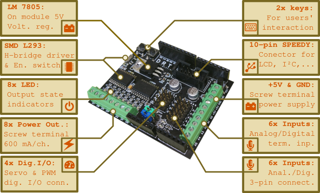

# RobDuino modul

## Opis modula

RobDuino je močnostini modul za krmilniško vezje Arduino Uno. Prilagojen je didaktični uporabi za poučevanje predmeta Robotika v tehniki v osnovnošolskem izobraževanju. Zasnovan je tako, da omogoča:
- boljši vpogled v krmiljenje izhodnih in vhodnih naprav,
- vijačne sponke za priključitev najrazličnejših, cenovno dostopnih elementov,
- opremljen z indikatorji stanja na izhodnih priključkih,
- dopolnjen z ločenim 5 V napajanjem z zaščito kratkostičnega toka.

# Uporaba

Za uporabo tega modula potrebujete kmilniško vezje Arduino Uno in nameščeno programsko optemo ([glej navodila](https://github.com/davidrihtarsic/RobDuino/tree/master/Namestitev_programov#namestitev-programske-opreme)).

Ko boste namestili knjižnico za enostavnejšo uporabo modula v razvojenm programskem okolju Arduino IDE, lahko preizkusite naslednje primere uporabe, ki jih najdete v:

* `File` --> `Exnamples` --> `RobDuino` >

## Primeri:
   * Blink
   * Blink_NOT
   * Digital_Output
   * Digital_Input
   * Digital_Input_PullUp
   * Digital_Input_Buttons
   * Analog_Input
   * Timer2_Interrupt
   * Digital_Output_PWM
   * Servo
   * LCD_4bit
   * I2C_scanner
   * LCD_i2c
   * LCD_i2c_and_BUTTONS
   * UltraSonic_HC-SR04

## Prispevajte k razvoju vsebin...

Pri nadaljnjem razvoju modula in vsebin za uporabo vas vljudno vabimo k sodelovanju. Morda nam za zečetek zaupate, s čim imate največ težav in izpolnite naslednji vprašalnik([link do vprašalnika](https://docs.google.com/forms/d/e/1FAIpQLScE_-8ULcLZwOefYqVWy1sHs-kDY3X2QsuWV3j7uNQr_XtQOw/viewform)).

